# Environment Setup

## 1. Install Miniconda

1.1. From the [official Conda documentation](https://docs.conda.io/en/latest/miniconda.html#windows-installers) download the Windows installer for **Python version 3.7**.

1.2. Once the download is complete, double-click the `.exe` file. You should see this installer window:

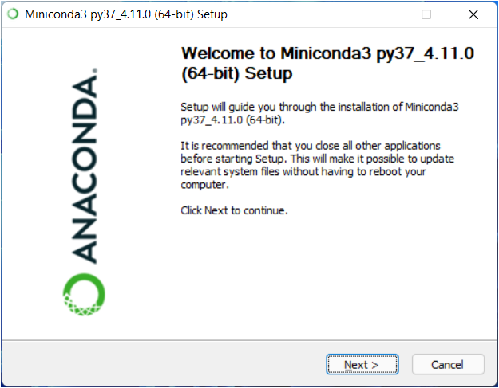

1.3. Use the default options for the installation. (The 'Destination Folder' may be left as the default recommended in your system. The screenshot below is just an example.)

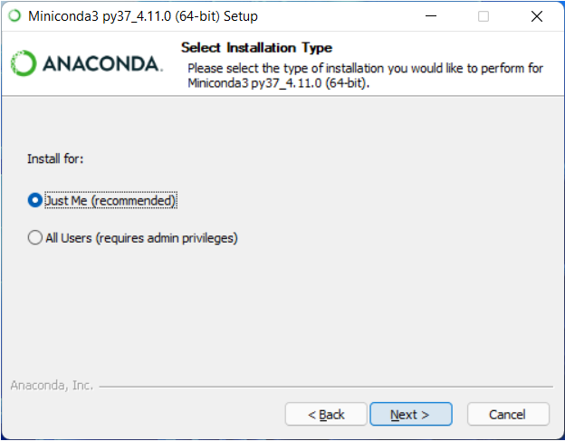

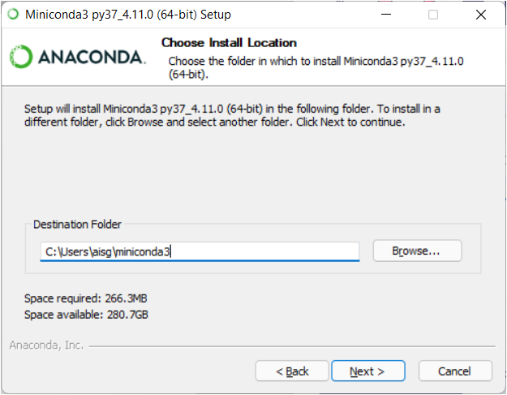

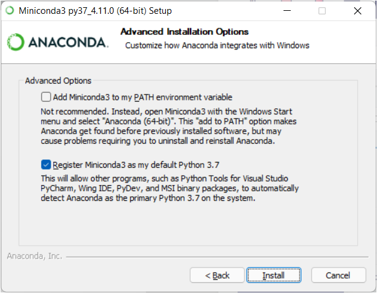

1.4. When installation is finished, from the Start menu, open Anaconda Prompt.

1.5. To test the installation, run the following command `conda list`. You should see an output similar to the following:

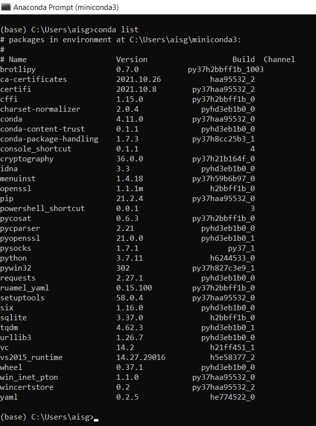

## 2. Set up conda environment for training & inference on CPU

2.1. Follow [this guide](https://docs.github.com/en/repositories/creating-and-managing-repositories/cloning-a-repository) to clone your GitHub repository into the local computer. You may use any of the options available - GitHub CLI, Desktop or Web browser. (If you're new to Git or GitHub, going though [this quickstart tutorial](https://docs.github.com/en/get-started/quickstart/set-up-git) is also recommended.)

If you have previously retrieved the code base from another source (e.g. download from Basecamp) and not from GitHub, it is recommended that you start afresh by cloning your GitHub repository in order to get the latest version of the code base. 

2.2. After cloning the repository into a folder, e.g. `C:\ai_engine`, you should see the following folder structure. (Some files seen below are automatically generated may not be present in the deployment package.)

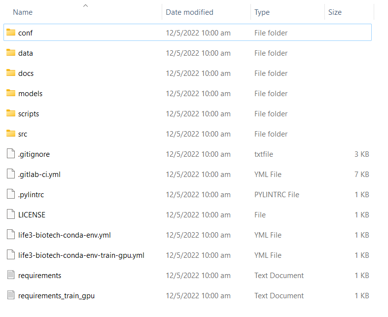

2.3. Open Anaconda Prompt and change the working directory to the location where the files were extracted using the following command:
```
cd C:\ai_engine
```

2.4. Enter the following command to create a new conda environment and install the relevant dependencies required by both the training & inference modules:
```
conda env create -f life3-biotech-conda-env.yml
```

2.5. Once the environment creation is complete, run `conda env list` and verify that the environment named `life3-biotech` is listed.

2.6. Run `conda activate life3-biotech` to activate the environment. It should now appear as the activated environment as per the screenshot below. The Conda environment setup is now complete.

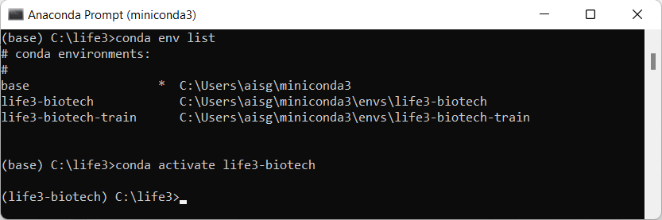

2.6. Enter the following command to check for your Python version. Ensure the version stated is _3.6.8_. 
```
python3 -V
```
or
```
python -V
```
Depending on your workstation setup, if older versions of Python had been installed before, the command to run Python scripts may differ. After checking which Python command to use (`python3` or `python`), do use the same command throughout this guide. For example, if the command `python3 -V` returns _3.6.8_, do continue to use `python3`.

## 3. Set up files required by AI engine

3.1. If this is the first time the AI engine is being set up in the current environment, Microsoft's _Build Tools for Visual Studio_ must be installed. Download it from [here](https://visualstudio.microsoft.com/downloads/#build-tools-for-visual-studio-2022).


3.2. Open the `.exe` file once the download is complete. Follow the steps until you reach this screen:

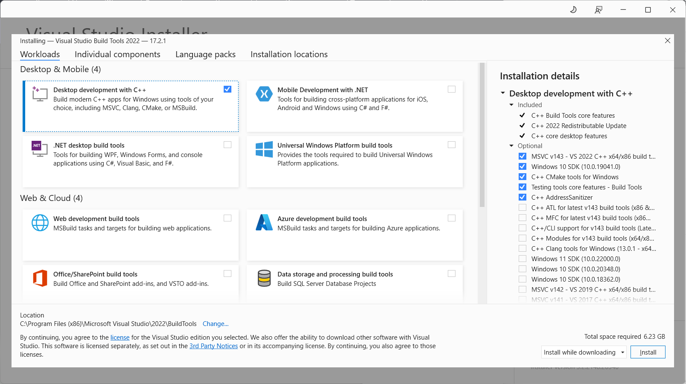

Select the "Desktop development with C++" option and click Install. The installation process may take a while.

3.3. Once installation is complete, you should see the below dialog box. Restart the computer before proceeding with the next steps.

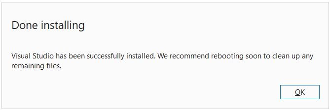

3.4. Open Anaconda Prompt and run the following commands to change the working directory to the location where the files were extracted and build the Cython files required by EfficientDet:
```
cd C:\ai_engine
python src/life3_biotech/modeling/EfficientDet/setup.py build_ext --inplace
```
You should see an output similar to the following:

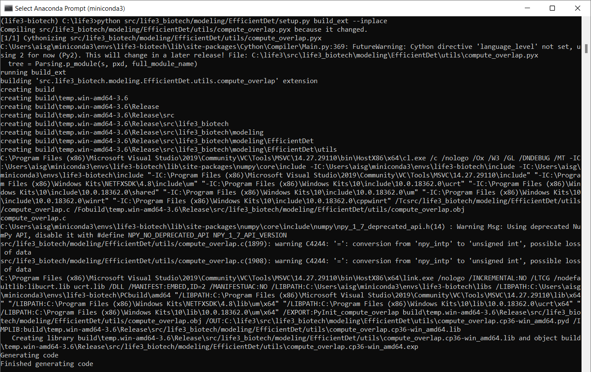

You may also see a `build` subfolder created in the working directory, e.g. `C:\ai_engine\build`.

3.5. In order to use the training module, data must exist in the `\data` subfolder. Copy the training data into its respective subfolder in the `\data\uploaded` subfolder. An example of the folder structure is as follows:

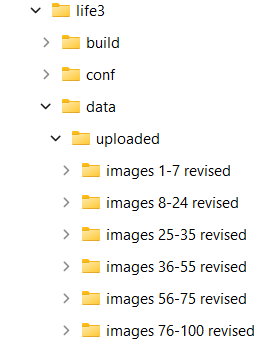

## 4. Set up Windows environment variables

4.1. Search for "environment variables" in the Windows search bar. Open "Edit the system environment variables" under Control Panel.

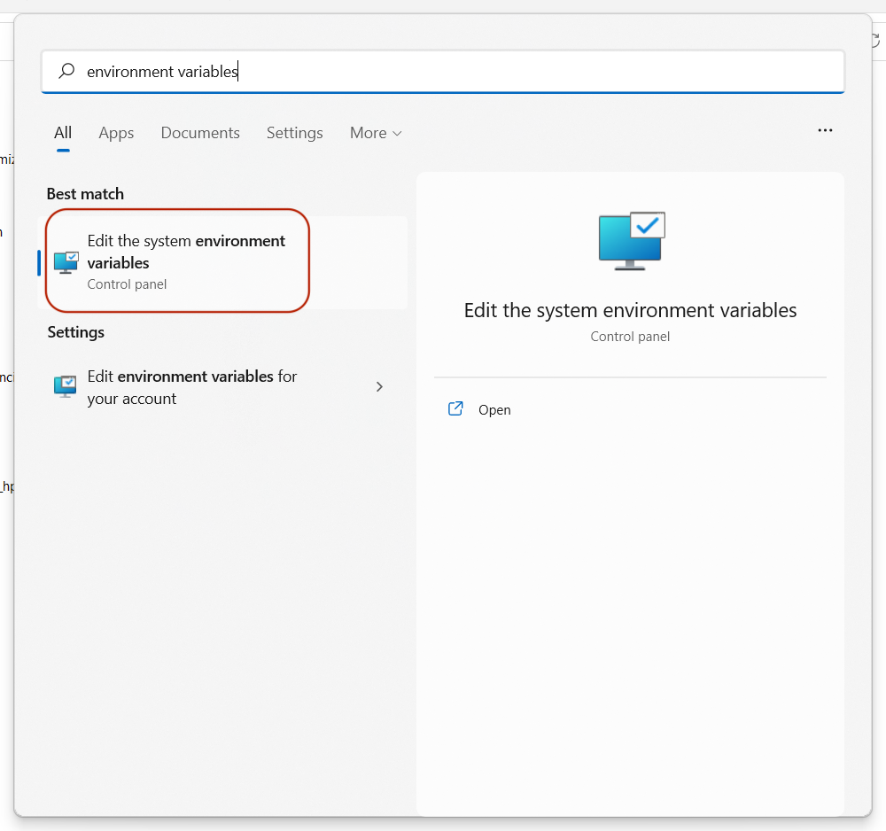

4.2. The following window will appear. Click on the "Environment Variables..." button.

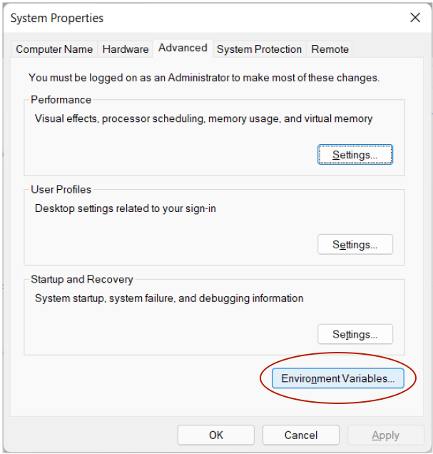

4.3. The following pop-up dialog will appear. Click on the "New..." button below the "System variables" list.

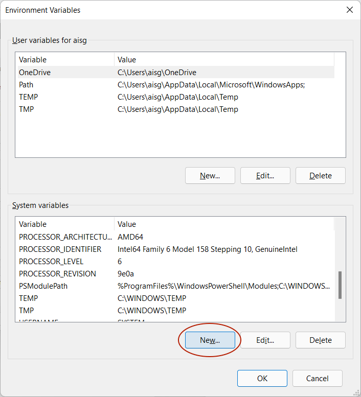

4.4. The following pop-up dialog will appear. In the 'Variable name' field, enter `PYTHONPATH`. Assuming the code base has been extracted to `C:\ai_engine`, in the 'Variable value' field, enter `C:\ai_engine\src;C:\ai_engine\src\life3_biotech\modeling\EfficientDet`. Click "OK".

4.5. You should see the new variable reflected in the "System variables" list. Click "OK".

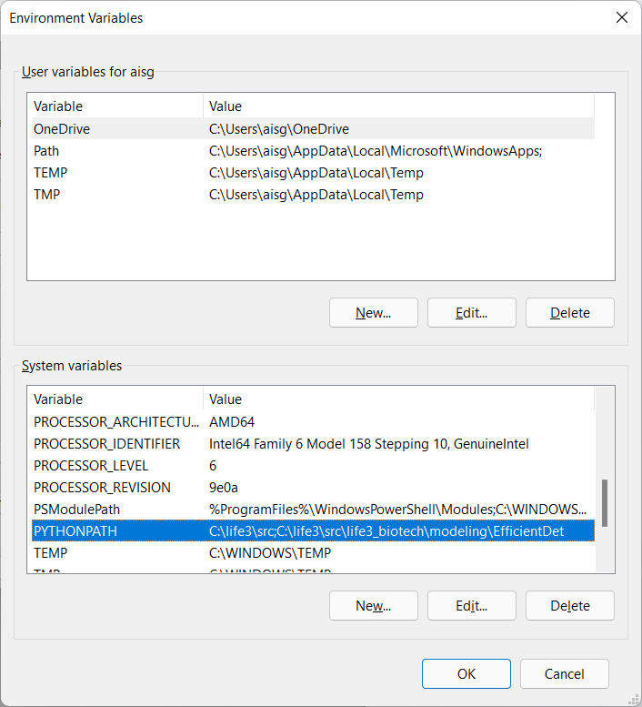

4.6. To verify whether the environment variables have been set up correctly, open a new Anaconda Prompt or Windows PowerShell window and run the following command:
```
set PYTHONPATH
```
You should see an output similar to the following:

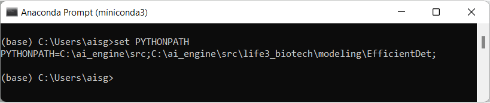

## 5. Set up conda environment for training on GPU (optional)

Please ensure that the machine you are setting up this conda environment on is GPU-enabled. If you have installed any other version of CUDA and/or cuDNN besides those mentioned in this guide, it is recommended to **uninstall** them first.

5.1. Open Anaconda Prompt and run `conda env list` and verify that the environment named `life3-biotech-train` is listed.


5.2. If the environment is not listed, use the following command to create a new conda environment and install the relevant dependencies required to run model training on GPU:
```
conda env create -f life3-biotech-conda-env-train-gpu.yml
```

If the environment already exists, enter the following command to update it:
```
conda env update -f life3-biotech-conda-env-train-gpu.yml
```

In comparison with the `life3-biotech` environment, `life3-biotech-train` contains two additional libraries, CUDA 10.1 and cuDNN 7.6.4, which are required for the AI engine to run on GPU-enabled machine.

5.3. Run `conda activate life3-biotech-train` to activate the environment. It should now appear as the activated environment.

Note: The steps in this section have been tested on Windows 11 Pro and may not work on other versions of Windows.
