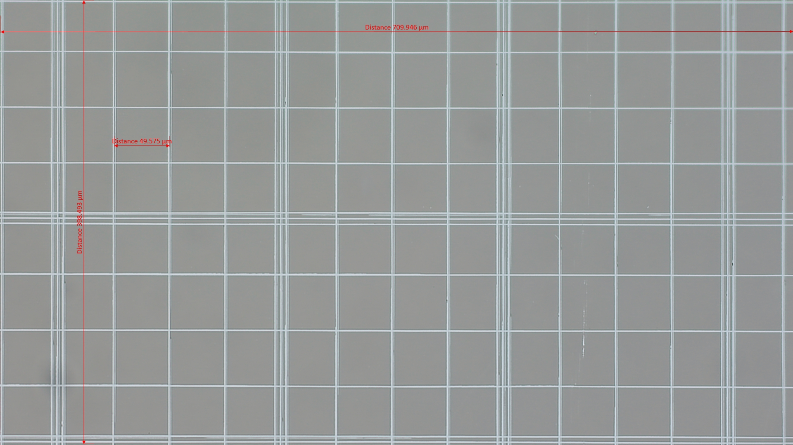
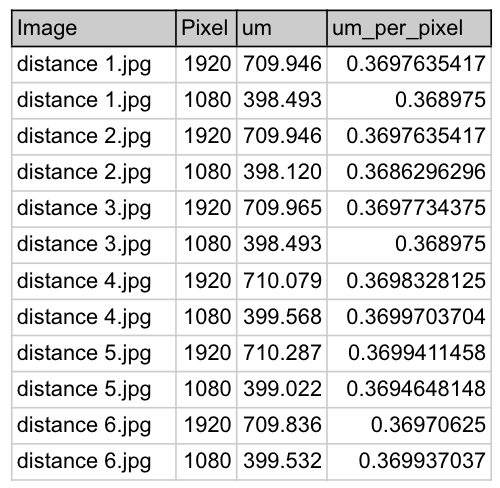

### APPENDIX 1: Cell size measurement - mapping pixel to micro-meter.

1. Using the cell magnification software, measure the width and length of at least **6** full size images as shown below.



2. Create a table similar to the one below. You can use your choice of software such as google doc or microsoft excel. 

Column 4 formula - um_per_pixel
```
Conversion for micrometer/pixel
Column3/Column2 = um/Pixel

Example row 1:
um_per_pixel = 709.946/1920 = 0.3697635417
```



3. Once you have generated column 4 (um_per_pixel) for all the values.  Perform the following aggregation statistics on column 4 (um_per_pixel) to reduce error introduce during manual measurement.

| Statistic | Value          |
| --------- | -------------- |
| mean:     | 0.369561048418 |
| std:      | 0.000451175100 |
| median:   | 0.369763541667 |
| mode:     | 0.369763541667 |

Recommended to select median to reduce the effect of outliers and skewed distributions.

## Configuration

The main configuration file used to customise the AI engine for cell measurement is `pipelines.yml`, located in `conf/life3` subfolder.

Under **inference:** Change the parameter `um_pixel_mapping` according to selected parameter such as median value.
```plaintext
  um_pixel_mapping: 0.369763541667
  small_mid_cell_cutoff: 4.0  
  mid_large_cell_cutoff: 8.0  
  use_calibrated_cellsize: True
```
`small_mid_cell_cutoff` and `mid_large_cell_cutoff` refer to value1 and value 2 in shown below. The value is the cutoff point between 2 cell of different size. User can defined the values according to their requirements or scientific findings.
### small cell size -> **value 1** -> medium cell size -> **value 2** -> large cell size

## Note: 
To make the model more accurate in terms of cell size counting, user can set `use_calibrated_cellsize` to **True** which will use the calibrated value instead of `small_mid_cell_cutoff` and `mid_large_cell_cutoff`
The calibrated cellsize can be found in `conf/calibrated_cellsize.csv`
